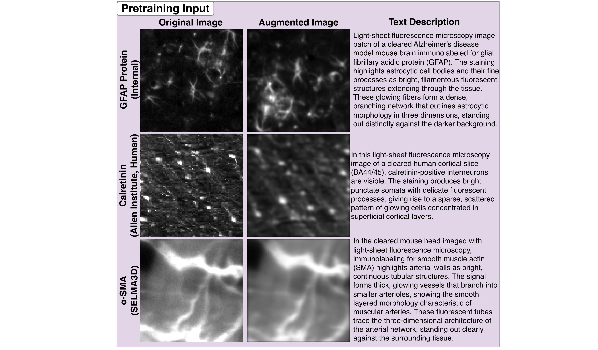

# Sample Patches

A small set of sample patches is included here so you can run a pretraining smoke test out of the box — no data download required. The configs point to these directories by default.

> **Want to train on the full dataset?** All five pretraining datasets are available on Zenodo: [https://doi.org/10.5281/zenodo.20149070](https://doi.org/10.5281/zenodo.20149070). See [Step 3 of the pretraining README](../README.md#step-3--get-training-data) for download and setup instructions.

---

## Example Patches

    

---

## Contents

### Patches

| Folder | Source | Description |
|---|---|---|
| [`wu_brain_patches/`](wu_brain_patches/) | Wu Lab | Sample mouse brain image patches |

### Text Prompts

Text prompt JSON files map patch filenames or directory names to biological text descriptions used during image+text pretraining. One file is provided per data source — add prompt files for any additional sources you enable.

| File | Used with |
|---|---|
| [`text_prompts_wu.json`](text_prompts_wu.json) | `wu_brain_patches/` |

---

## Full Dataset

The full pretraining dataset spans five sources and is available on Zenodo:

**[https://doi.org/10.5281/zenodo.20149070](https://doi.org/10.5281/zenodo.20149070)**

| Archive | Source | Config key |
|---|---|---|
| `all_wu_brain_patches.tar.gz` | Wu brain atlas | `wu` |
| `all_selma_patches_96.tar.gz` | SELMA cell types | `selma` |
| `all_allen_human2_patches.tar.gz` | Allen Human Brain Atlas | `human2` |
| `all_allen_developing_mouse_patches.tar.gz` | Allen Developing Mouse Brain | `dev_mouse` |
| `all_allen_connection_projection_patches.tar.gz` | Allen Mouse Brain Connectivity Atlas | `connection` |

