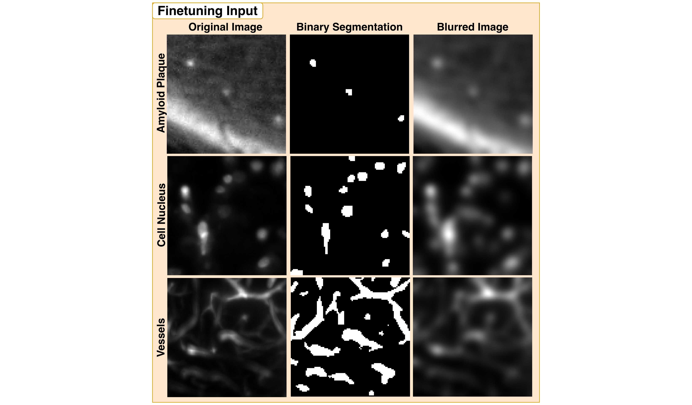

# Sample Patches

A small set of sample patches is included here so you can run a finetuning smoke test out of the box — no data download required. The configs point to these directories by default.

<div align="center">
    
</div>

---

## Contents

Each split contains three patch types, each with an image, a binary label mask, and a blurred counterpart:

```
sample_patches/
├── train/
│   ├── amyloid_plaque_patch_000_vol000_ch0.nii.gz
│   ├── amyloid_plaque_patch_000_vol000_ch0_label.nii.gz
│   ├── amyloid_plaque_patch_000_vol000_ch0_blurred.nii.gz
│   ├── cell_nucleus_patch_002_vol007_ch0.nii.gz
│   ├── cell_nucleus_patch_002_vol007_ch0_label.nii.gz
│   ├── cell_nucleus_patch_002_vol007_ch0_blurred.nii.gz
│   ├── vessels_patch_014_vol013_ch0.nii.gz
│   ├── vessels_patch_014_vol013_ch0_label.nii.gz
│   └── vessels_patch_014_vol013_ch0_blurred.nii.gz
├── val/                                                    # same structure as train/
└── test/                                                   # same structure as train/
```

| File suffix | Used by | Description |
|---|---|---|
| `.nii.gz` | Segmentation · Classification · Deblurring | Image patch |
| `_label.nii.gz` | Segmentation | Binary label mask |
| `_blurred.nii.gz` | Deblurring | Blurred version of the image patch |

All three tasks can share the same directories — each script automatically skips files that are not relevant to it.