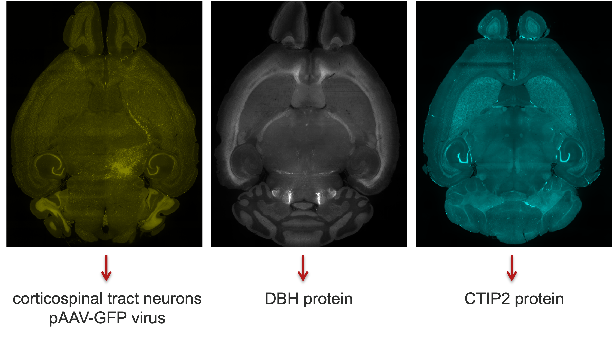

# 🏷️ Classification

Finetune a pretrained LSM foundation model for **multiclass patch classification** of 3D light sheet microscopy patches.

<div align="center">
    
</div>

| | UNet | SwinUNETR |
|---|---|---|
| **Config** | `finetune_classification_unet_config.yaml` | `finetune_classification_swinunetr_config.yaml` |
| **Job script** | `finetune_classification_unet_job.sh` | `finetune_classification_swinunetr_job.sh` |
| **Submit** | `sbatch finetune_classification_unet_job.sh` | `sbatch finetune_classification_swinunetr_job.sh` |

---

## Contents

| File | Description |
|---|---|
| [`finetune_classification_utils.py`](finetune_classification_utils.py) | Shared utilities, dataset, and base logic used by both backbones |
| [`finetune_classification_unet.py`](finetune_classification_unet.py) | UNet finetuning and inference script |
| [`finetune_classification_unet_config.yaml`](finetune_classification_unet_config.yaml) | UNet config — set data paths, checkpoint, and hyperparameters |
| [`finetune_classification_unet_job.sh`](finetune_classification_unet_job.sh) | UNet SLURM job script |
| [`finetune_classification_swinunetr.py`](finetune_classification_swinunetr.py) | SwinUNETR finetuning and inference script |
| [`finetune_classification_swinunetr_config.yaml`](finetune_classification_swinunetr_config.yaml) | SwinUNETR config — set data paths, checkpoint, and hyperparameters |
| [`finetune_classification_swinunetr_job.sh`](finetune_classification_swinunetr_job.sh) | SwinUNETR SLURM job script |

---

## Data Format

Patches should be NIfTI files (`.nii.gz`) in a flat directory. The class label is inferred automatically from the filename prefix up to `_patch_`:

```
train/
    amyloid_plaque_patch_000_vol000_ch0.nii.gz   → class: amyloid_plaque
    amyloid_plaque_patch_001_vol001_ch0.nii.gz   → class: amyloid_plaque
    cell_nucleus_patch_002_vol007_ch0.nii.gz     → class: cell_nucleus
    vessels_patch_014_vol013_ch0.nii.gz          → class: vessels
```

Label files (ending in `_label.nii.gz`) and blurred files (ending in `_blurred.nii.gz`) are automatically skipped, so classification, segmentation, and deblurring patches can all share the same directories.

---

## Quick Start

### Step 1 — Configure

Edit the config for your chosen backbone and update the key fields:

```yaml
train_dir:       ../../sample_patches/train/
val_dir:         ../../sample_patches/val/
test_dir:        ../../sample_patches/test/
out_root:        ../../output/
pretrained_ckpt: ../../../01-pretraining/output/pretrained_unet_best.ckpt
                 # or pretrained_swinunetr_best.ckpt
```

Pretrained checkpoints are available on Zenodo: [https://doi.org/10.5281/zenodo.20146516](https://doi.org/10.5281/zenodo.20146516). Set `pretrained_ckpt` to your downloaded checkpoint, or set `init: scratch` to train from random initialization.

### Step 2 — Update the job script

```bash
#SBATCH --partition=your-gpu-partition   # your cluster's GPU partition
module load anaconda3                    # your cluster's anaconda module
export WANDB_API_KEY=your_key_here       # or run `wandb login` interactively
```

### Step 3 — Run

Submit from this directory:

```bash
cd 02-finetuning/scripts/classification
sbatch finetune_classification_unet_job.sh      # UNet
sbatch finetune_classification_swinunetr_job.sh # SwinUNETR
```

Outputs written to `02-finetuning/output/`:

| Output | Location |
|---|---|
| Checkpoints | `output/checkpoints/` |
| Per-patch predictions | `output/preds/preds.csv` |
| Confusion matrix | `output/preds/confusion_matrix.csv` |
| Per-class precision, recall, F1 | `output/preds/per_class_metrics.csv` |
| Logs | `output/logs/` |
| Training curves + accuracy | WandB |

---

## Advanced

<details>
<summary>Finetune on your own data</summary>

Point `train_dir`, `val_dir`, and `test_dir` in the config to your own directories. If you don't have separate val and test sets, omit `val_dir` and `test_dir` — the data will be split automatically from `train_dir` using `train_percent` and `val_percent`.

Patches must be named `<class_name>_patch_<anything>.nii.gz`. Everything before the first `_patch_` becomes the class label — no separate label files needed.

</details>

<details>
<summary>Training hyperparameters</summary>

| Parameter | Description |
|-----------|-------------|
| `channel_substr` | Channel filter: `ch0`, `ch1`, or `ALL` (default: ALL) |
| `train_percent` | Fraction of data for training when auto-splitting (default: 0.70) |
| `val_percent` | Fraction of data for validation when auto-splitting (default: 0.15) |
| `min_train` | Minimum patches required for training (default: 1) |
| `min_val` | Minimum patches required for validation (default: 1) |
| `min_test` | Minimum patches required for test (default: 1) |
| `lr` | Learning rate (default: 0.0001) |
| `freeze_encoder_epochs` | Epochs to freeze encoder before finetuning it (default: 5) |
| `linear_probe` | Freeze encoder for entire training — only train classification head (default: false) |
| `max_epochs` | Maximum training epochs (default: 200) |
| `early_stopping_patience` | Epochs without val_accuracy improvement before stopping (default: 50) |
| `class_weighting` | Class imbalance strategy: `none`, `inverse_freq`, or `effective_num` (default: inverse_freq) |
| `init` | `pretrained` or `scratch` (default: pretrained) |

</details>

<details>
<summary>Architecture parameters — must match pretraining</summary>

**UNet:**

| Parameter | Description |
|-----------|-------------|
| `unet_channels` | Feature channels per encoder level (default: 32,64,128,256,512) |
| `unet_strides` | Downsampling strides per level (default: 2,2,2,1) |
| `unet_num_res_units` | Residual units per level (default: 2) |
| `unet_norm` | Normalization: `BATCH`, `INSTANCE`, or `LAYER` (default: BATCH) |

**SwinUNETR:**

| Parameter | Description |
|-----------|-------------|
| `swinunetr_feature_size` | Model capacity — must match pretraining (default: 48) |

</details>

<details>
<summary>Hardware settings</summary>

```bash
#SBATCH --gres=gpu:1
#SBATCH --mem=128G
#SBATCH --cpus-per-task=8
#SBATCH --ntasks-per-node=1
```

</details>