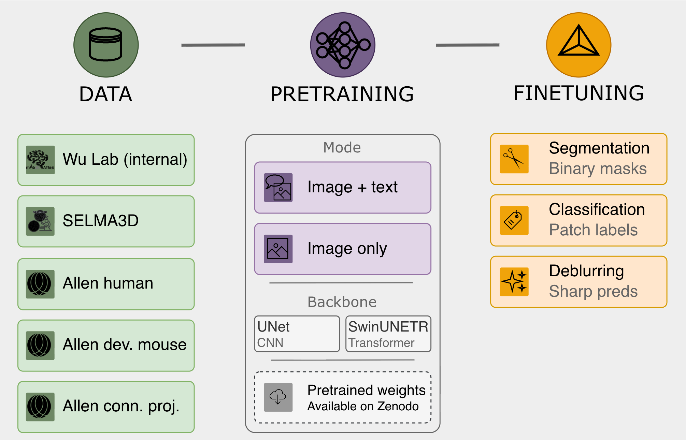

<div align="center">

# Light Sheet Microscopy Foundation Model

**Pretrain and finetune 3D foundation models for light sheet microscopy image analysis**

[](https://doi.org/10.5281/zenodo.20146516)
[](https://doi.org/10.5281/zenodo.20149070)
[](https://arxiv.org)
[](LICENSE)

<!-- Pipeline figure — replace the line below with your methods figure once available -->


</div>

---

## Overview

This repository provides code for pretraining and finetuning 3D foundation models for light sheet microscopy (LSM) image analysis. Two backbone architectures are supported — **UNet** and **SwinUNETR** — with pretraining modes for both **image+text** (CLIP-style) and **image-only** objectives. Three downstream finetuning tasks are supported: binary segmentation, multiclass patch classification, and image deblurring.

> **Don't want to run pretraining?** Pretrained checkpoints are available on [Zenodo](https://doi.org/10.5281/zenodo.20146516) — download one and jump straight to [finetuning](#finetuning).

<!-- Results figure — replace the line below with your results figure once available -->
<!--  -->

---

## Quick Start

```bash
git clone https://github.com/AdinaScheinfeld/lsm_fm_public_repo.git
cd lsm_fm_public_repo
conda env create -f setup/environment.yaml
conda activate lsm-pretrain
```

**Requirements:** Linux · NVIDIA GPU(s) with CUDA · Conda

---

## Pretrained Weights

[](https://doi.org/10.5281/zenodo.20146516)

Four pretrained checkpoints are available — choose the backbone and pretraining mode that fits your use case:

| Checkpoint | Backbone | Pretraining mode | Best for |
|---|---|---|---|
| `pretrained_unet_image_text.ckpt` | UNet | Image + text | Labeled biological structures |
| `pretrained_unet_image_only.ckpt` | UNet | Image only | General morphology |
| `pretrained_swinunetr_image_text.ckpt` | SwinUNETR | Image + text | Labeled biological structures |
| `pretrained_swinunetr_image_only.ckpt` | SwinUNETR | Image only | General morphology |

---

## Pretraining

[](https://doi.org/10.5281/zenodo.20149070)

To pretrain your own model from scratch, see **[01-pretraining/README.md](01-pretraining/README.md)**.

The full pretraining dataset (five archives) is available on [Zenodo](https://doi.org/10.5281/zenodo.20149070). Two pretraining modes are supported:

| Mode | Objective | When to use |
|---|---|---|
| **Image + text** | CLIP-style contrastive loss + masked reconstruction + teacher distillation | When biological text labels are available |
| **Image only** | Masked reconstruction + teacher distillation | When no text labels are available |

---

## Finetuning

To finetune a pretrained model on a downstream task, see **[02-finetuning/README.md](02-finetuning/README.md)**.

Three downstream tasks are supported, each with both UNet and SwinUNETR backbones:

| Task | Input | Output | Metric |
|---|---|---|---|
| ✂️ **Segmentation** | Image + binary label mask | Predicted binary mask | Dice@0.5 |
| 🏷️ **Classification** | Image patch | Predicted class label | Accuracy, macro F1 |
| ✨ **Deblurring** | Blurred/sharp image pair | Deblurred NIfTI prediction | PSNR, SSIM |

---

## Repository Structure

```
lsm_fm_public_repo/
├── 00-helpers/
│   ├── all_datasets_transforms.py       # Shared data augmentation and loading transforms
│   └── visualization_functions.py       # WandB logging and visualization utilities
├── 01-pretraining/
│   ├── sample_patches/                  # Sample NIfTI patches and text prompt JSON files
│   └── scripts/                         # Pretraining scripts, configs, and job scripts
│       ├── data_module.py
│       ├── multisource_patch_image_only_dataset.py
│       ├── multisource_patch_image_text_dataset.py
│       ├── pretrain_module_unet.py
│       ├── pretrain_unet.py
│       ├── pretrain_unet_config.yaml
│       ├── pretrain_unet_job.sh
│       ├── pretrain_module_swinunetr.py
│       ├── pretrain_swinunetr.py
│       ├── pretrain_swinunetr_config.yaml
│       └── pretrain_swinunetr_job.sh
├── 02-finetuning/
│   ├── sample_patches/                  # Sample NIfTI patches, label masks, and blurred patches
│   └── scripts/
│       ├── segmentation/                # Binary segmentation finetuning scripts
│       ├── classification/              # Multiclass patch classification finetuning scripts
│       └── deblurring/                  # Image deblurring finetuning scripts
└── setup/
    ├── download_bert_model.py           # Downloads BERT model for image+text pretraining
    └── environment.yaml                 # Conda environment specification
```

---

## Citation

If you use this code or the pretrained models in your work, please cite our paper (coming soon on arXiv):

```bibtex
@article{lsm_foundation_model,
  title   = {coming soon},
  author  = {coming soon},
  journal = {arXiv},
  year    = {2025}
}
```

---

## Citation

If you use this code or the pretrained models in your work, please cite our paper. The arXiv preprint is coming soon — this section will be updated with the full citation when it is available.

```bibtex
@article{scheinfeld2026lsm,
  title   = {coming soon},
  author  = {coming soon},
  journal = {arXiv},
  year    = {2026},
  url     = {coming soon}
}
```

---

## Contact

If you have questions, encounter a bug, or run into issues running the code, please [open a GitHub issue](https://github.com/AdinaScheinfeld/lsm_fm_public_repo/issues) and we will do our best to help.

---

- Patch files must be in NIfTI format (`.nii.gz`), 3D, and single-channel
- Default patch size is 96×96×96 voxels
- Intensity is normalized to [0, 1] during loading — the model is robust to different intensity ranges
- Architecture parameters (`unet_strides`, `unet_norm`, `swinunetr_feature_size`, etc.) must match between pretraining and finetuning configs